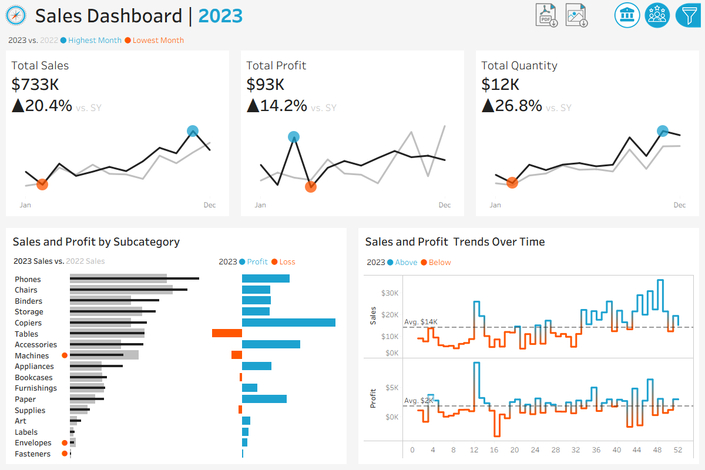
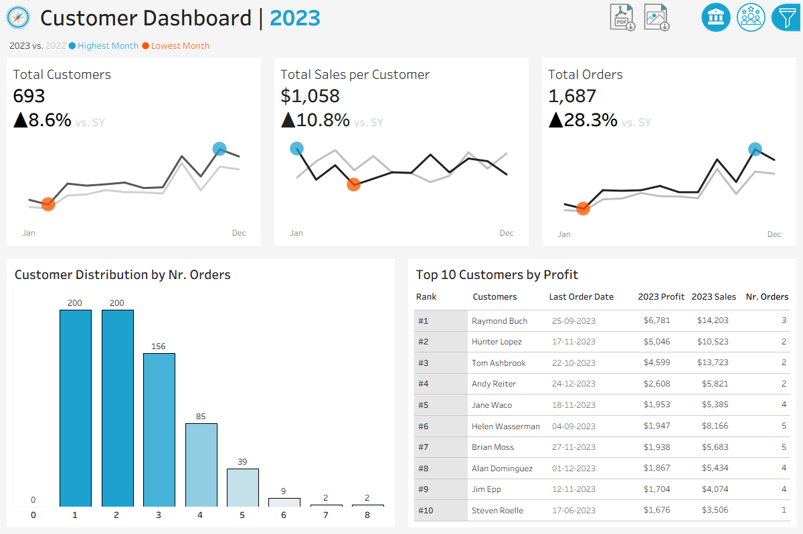
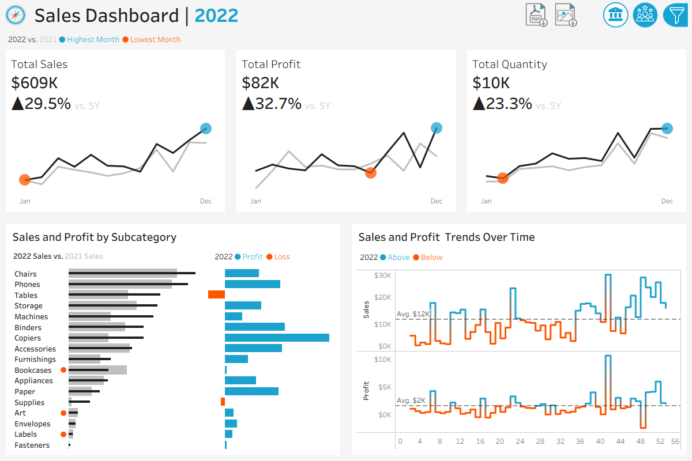
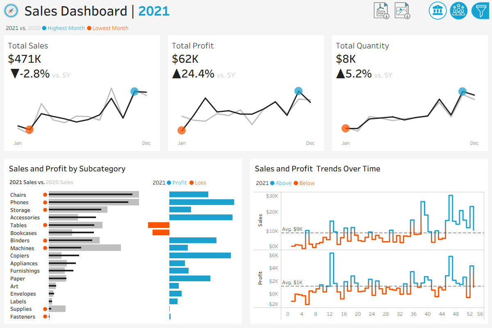
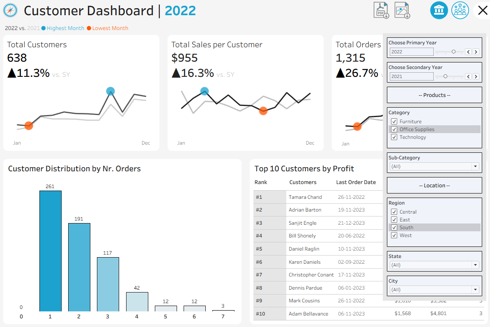
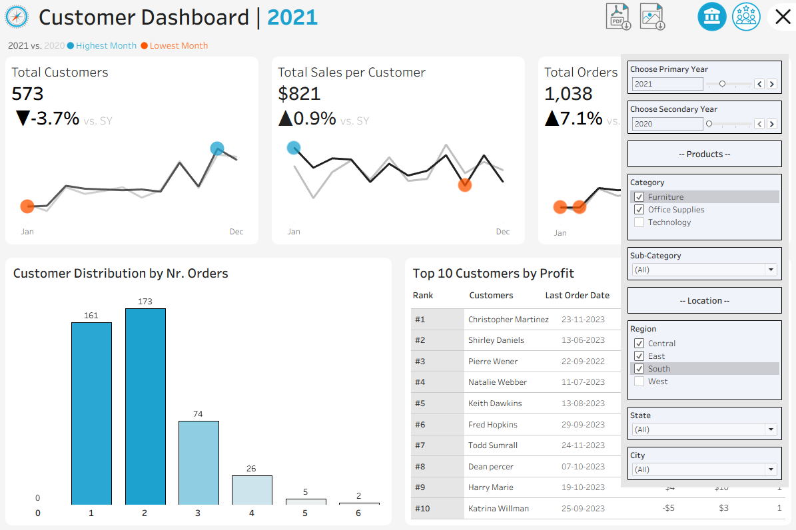

# Sales Customer Analytics Dashboard

This project presents an interactive **Sales and Customer Analytics Dashboard** developed using Tableau to help stakeholders analyze business performance, customer behavior, and sales trends.

The dashboard enables users to compare any two selected years dynamically, allowing all KPIs, charts, and dashboard text to automatically update based on the selected years.

The project is designed as a portfolio project showcasing:

* Business intelligence dashboard development
* Sales and customer analytics
* Interactive KPI reporting
* Data visualization and dashboard storytelling
* Dashboard interactivity and navigation design

---

## Dashboard Overview   

The project contains two primary dashboards:

### Sales Dashboard

<div align="center">
  
</div>
<br>
The Sales Dashboard provides an overview of sales performance and year-over-year business trends. 

It enables users to monitor key metrics such as total sales, profit, and order quantity while analyzing monthly and weekly performance patterns.

Users can compare sales metrics between any two selected years, identify high and low-performing periods, and evaluate product subcategory performance across different regions and locations.

### Customer Dashboard

<div align="center">
  
</div>
<br>
The Customer Dashboard focuses on customer behavior, engagement, and 
profitability analysis. 

It provides insights into customer purchasing patterns, order distribution, and top-performing customers.

The dashboard helps stakeholders understand customer trends over time, evaluate customer contribution to profitability, and analyze customer activity across multiple dimensions using interactive filters.

---
## Dashboard Features

### Interactive Features

- Dynamic comparison between any two selected years.
- All visualizations and KPIs dynamically update based on the selected filters
- Cross-filtering between dashboard visualizations
- Interactive chart selections that update the entire dashboard

<div align="center">
Comparison Year Example 1
<br>
  

<sub>Selected Years: 2022 vs 2021</sub>
</div>

<div align="center">
Comparison Year Example 2
<br>
  

<sub>Selected Years: 2021 vs 2020</sub>
</div>

### Navigation & Controls

- Navigation buttons for switching between dashboards
- Toggle buttons for showing and hiding filters
- Export buttons for downloading dashboards as PDF or image files
- Custom icons used for dashboard controls and navigation

### Filters

The dashboards support dynamic filtering, allowing users to analyze sales and customer performance across different product categories and geographic locations. 

- Category
- Subcategory
- Region
- State
- City

<div align="center">
Before Filter Selection
<br>
  
<br>
<sub>
Years: 2022 vs 2021 |
Category: All |
Subcategory: All |
Region: Central, East |
State: All |
City: All
</sub>
</div>
<br>

<div align="center">
After Filter Selection
<br>
  
<br>
<sub>
Years: 2021 vs 2020 |
Category: Furniture, Office Supplies |
Subcategory: All |
Region: Central, East, South |
State: All |
City: All
</sub>
</div>

---

## Repository Structure

```
sales-customer-analytics-dashboard/
│
├── datasets/                          # Source datasets used for dashboard development
│   ├── Customers.csv
│   ├── Location.csv
│   ├── Orders.csv
│   └── Products.csv
│
├── images/                            # Dashboard screenshots, icons, and logos used in the project
│
├── Sales Customer Dashboard.twbx      # Tableau packaged workbook containing dashboards and visualizations
│
├── README.md                         	# Project overview and instructions
├── LICENSE                             # License information for the repository
└── .gitignore                          # Files and directories to be ignored by Git
```
---

## [Tableau Public Dashboard](https://public.tableau.com/views/SalesCustomerDashboard_17782340995890/SalesDashboard)

---

## License

This project is licensed under the [MIT License](LICENSE). You are free to use, modify, and share this project with proper attribution.

---
